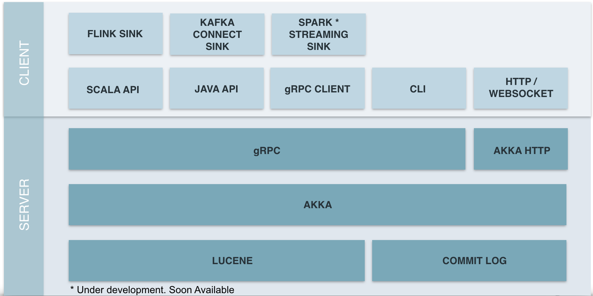

# Nsdb Architecture

NSDb is a time series database, thus it is optimized for handling time series data, i.e. a series of multi dimensional data points indexed by time.
A time series record, called `Bit` in the NSDb nomenclature, is a record composed of:

* a `timestamp`, a long field that represent the record time instant
* a `value`, a numerical value ( INT, BIGINT or DECIMAL), that rapresent the Bit main characteristic, the number that identify the main bit feature at a given timestamp.
* `dimensions`, set of key - value pairs. Keys are strings and can be considered as the dimension name; dimension's value can be a STRING, an INT, a BIGINT or a DECIMAL and tells us that the value referred to a key. Dimensions are secondary Bit characteristic and can be used to filter or aggregate results.

If we want to model the number of accesses to emergency rooms in a country (or in a state or a region) we can use a time series record (a `Bit`) with the following features:

* access time as the timestamp
* the number of patients entered in the ER for triage as the `Value`
* some additional information useful for filtering and aggregating as `dimensions`
  - the hospital name
  - the patients priority
  - the hospital coordinates (geohash)

### Bit Containers

A series of time series records (bits) is called `metric`.

NSDb provides two levels of containers for metrics: `database` and `namespace`.

A bit belongs to a namespace, which belongs to a database.

To declare the database and the namespace is not required in a sql statement, but it is necessary in the outer context (e.g. rest apis, java apis or cli)

## Schema design

Given the time series nature of NSDb, it would be improper to talk about a metric's schema because each bit can have different dimensions.
Anyway, it is important to point out that bits of the same metric must be homogeneous to each other.
The following rules must be followed by a series of Bits:

* value type must be the same (e.g. DECIMAL or INT)
* dimensions can be present or not, but if present their type must be the same among bits; e.g. dimension `d` can be present in `bit1` and not in `bit2` but if a bit contains the same dimension with a different type (STRING vs INT for example) it will be rejected.

Given the above preconditions, it is possible to infer and retrieve a schema for a metric, which will be composed of:

* a long timestamp
* a numeric value
* the union of each bit's dimensions

## Sql support

NSDb supports a custom sql like query language.
For more information the [full doc](SQL_doc.md) could be examined.

Essentially, dimensions and timestamp can be used to compose where conditions or group by clauses and value for aggregation clauses.

Reusing the ER example explained above, in order to select accesses with WHITE priority and sort results by time we can run this query

```sql
select * from accesses where priority = WHITE order by timestamp desc
```

while for retrieving the sum of accesses grouped by priority this query can be used

```sql
select sum(value) from accesses group by priority
```

## Publish Subscribe Streaming

Perhaps the most interesting feature of NSDb is a special case of data streaming based on a publish subscribe pattern.


A user needs to subscribe by performing the following steps:

* open a Websocket
* send a specific json message providing a database, a namespace and a valid query

NSDb will return the query results, the `Historical data` first, then, every time a record that fulfills the query provided is inserted, it will be sent to the subscriber's websocket.
If we consider NSDb as a Source and the subscriber as a Sink, this publish subscribe mechanism can be interpreted as a simple streaming pipeline.

## Overall Architecture




NSDb strongly relies on [akka](https://github.com/akka/akka), _the implementation of the Actor Model on the JVM._

This model gives the right abstraction to build high traffic, concurrent and distributed systems.
Using it makes easy to handle concurrency, and also provides abstraction for creating and maintaining a cluster of actors (e.g. it's not necessary to implement gossip and anti entropy protocols).

### Storage System

NSDb takes full advantage of [Apache lucene™](https://lucene.apache.org/core/), thanks to which it is possible to index bits and run high performance searches. It also provides many primitives useful to optimize indexes and related queries to fit time series requirements.

In addition to Lucene, the native file system is used for writing a commit log, used to keep track of all the writes and deletions happened in the system; it is essential in case of  disaster recovery. In fact, all the log entries are written before being performed, so that it is possible to replay them in case of failure.

### Consistency

In order to maximize write throughput and also to guarantee a real time events delivery, It has been decided to adopt a custom `consistency` strategy.
After the write operation has been logged in the commit log, it is accumulated into an internal buffer which is periodically flushed into the index, and in parallel it is checked against all the subscribed query and published to all the suitable subscribers.
This means, that from the subscriber point of view, the effects of an insert operation will be observable in real time, while for ordinary users, NSDb behaves like a `eventual consistent` system, i.e. records are stored only after a configurable interval.

### Shards

One of the most relevant property of a time series database is that data continuously comes, will be always inserted and never updated, and given the nature of the data itself, that is the fact that it's naturally ordered by time, leads us to adopt a sharding strategy called ***Natural Time Sharding***.

Users can configure a sharding interval
```
sharding {
 enabled = true
 interval = 15s //15m 15d 1y are valid values
}
```

according to which, shards will be created.


### Clustering and replication
Coming soon!
